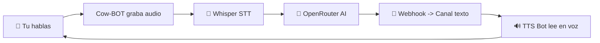

<div align="center">

<!-- HEADER CAPSULE: Shark + Twinkling -->


<!-- TYPING SVG: 5 frases en español -->
<a href="https://github.com/Riutexu/COWBOT-">
  
</a>

<br><br>

---

## 🐄 ¿Que es Cow-BOT?

> Un bot de Discord que **escucha tu voz**, la procesa con **Inteligencia Artificial** y envia la respuesta a un canal de texto como si fuera un **usuario humano** (via webhook). El famoso **TTS Bot** lee automaticamente la respuesta en el canal de voz.



---

## ⚡ SKILL TREE

<div align="center">

### Nivel 1: Integracion Discord


### Nivel 2: Speech-to-Text (Whisper)


### Nivel 3: Motor de IA (OpenRouter)


### Nivel 4: Sistema Anti-Deteccion (Webhook)


### Nivel 5: Voice Activity Detection (VAD)


</div>

---

## 🛠️ Tecnologias

<p align="center">
  <a href="https://skillicons.dev">
    
  </a>
</p>

| Tecnologia | Proposito |
|---|---|
|  **Python 3.10+** | Lenguaje principal |
|  **discord.py** | Conexion con Discord (voice + texto) |
|  **Whisper (Hugging Face)** | Speech-to-Text gratuito |
|  **OpenRouter** | IA generativa gratuita (Mistral 7B) |
|  **Webhooks** | Envio de mensajes como usuario humano |

---

## 📁 Estructura del proyecto

```text
📦 Cow-BOT/
├── 📄 main.py                  # Punto de entrada
├── 📄 config.py                # Validacion de configuracion
├── 📄 personality.md           # Personalidad del bot (editable) 🎭
├── 📄 voice_handler.py         # VAD + grabacion de audio
├── 📄 stt.py                   # Whisper API con retry
├── 📄 ai_response.py           # OpenRouter + fallbacks
├── 📄 webhook_sender.py        # Webhook con delay humano
├── 📄 logger_setup.py          # Logging profesional
├── 📄 requirements.txt         # Dependencias
└── 📄 .env.example             # Plantilla de configuracion
```

---

## 🚀 Instalacion

### 1. Crear cuentas gratuitas

| Servicio | Link | para que sirve |
|---|---|---|
| Discord Developer Portal | [🔗 Crear App](https://discord.com/developers/applications) | Obtener **DISCORD_TOKEN** |
| Hugging Face | [🔗 Registro](https://huggingface.co/join) | Obtener **HUGGINGFACE_TOKEN** (STT) |
| OpenRouter | [🔗 Registro](https://openrouter.ai/) | Obtener **OPENROUTER_KEY** (IA) |
| Bot-Hosting.net | [🔗 Registro](https://bot-hosting.net/) | Hosting **gratis 24/7** |

### 2. Configurar entorno

```bash
# Clonar repositorio
git clone https://github.com/Riutexu/COWBOT-.git
cd Cow-BOT

# Instalar dependencias
pip install -r requirements.txt

# Configurar variables de entorno (Windows PowerShell)
$env:DISCORD_TOKEN = "tu_token_aqui"
$env:HUGGINGFACE_TOKEN = "hf_tu_token"
$env:OPENROUTER_KEY = "sk-or-v1-tu_key"
$env:TEXT_CHANNEL_ID = "123456789"
$env:VOICE_CHANNEL_ID = "123456789"
$env:TARGET_USER_IDS = "111111,222222"
$env:WEBHOOK_URL = "https://discord.com/api/webhooks/..."
```

> **TIP**: Copia `.env.example` como `.env` y llena los valores. El bot leera automaticamente las variables.

### 3. Ejecutar

```bash
python main.py
```

---

## 🎨 Apariencia: Banner y perfil de Discord

Para que tu bot tenga una **apariencia profesional** en Discord:

### Avatar del Bot
1. Ve a [Discord Developer Portal](https://discord.com/developers/applications)
2. Selecciona tu aplicacion → **General Information**
3. Sube un avatar de **512x512 PNG** (recomendado: logo de Cow-BOT)
4. Ponle un nombre llamativo: `Cow-BOT 🐄`

### Banner del Bot (solo bots verificados)
Si tu bot esta en **mas de 100 servidores** puedes solicitar verificacion y tendras:
- Banner cuadrado de **600x240**
- Fondo personalizado en el perfil del bot
- Tag `VERIFIED` en el perfil

### Rich Presence (Actividad personalizada)
El bot ya incluye en `main.py:34` una presencia personalizada:
```python
await self.bot.change_presence(
    activity=discord.Activity(
        type=discord.ActivityType.listening,
        name="a los compas 🐄"
    )
)
```
Puedes cambiar `listening` por `playing`, `watching` o `streaming`:

| Tipo | Codigo | Muestra |
|---|---|---|
| Escuchando | `ActivityType.listening` | "Escuchando a los compas 🐄" |
| Jugando | `ActivityType.playing` | "Jugando al cowboy digital" |
| Viendo | `ActivityType.watching` | "Viendo tus jugadas maestras" |
| Transmitiendo | `ActivityType.streaming` | "Transmitiendo desde el rancho" |

### Descripcion del Bot
En Discord Developer Portal → **General Information** → **Description**:
```
🐄 Cow-BOT - El vaquero digital del voice chat
Te escucho, pienso y respondo automaticamente.
Creado al estilo Cowdeidad 🎮🤠
```

---

## ⚙️ Configuracion avanzada

### Variables de entorno

| Variable | Obligatorio | Descripcion |
|---|---|---|
| `DISCORD_TOKEN` | ✅ | Token del bot en Discord |
| `HUGGINGFACE_TOKEN` | ✅ | Token de Hugging Face (Whisper STT) |
| `OPENROUTER_KEY` | ✅ | API Key de OpenRouter (IA) |
| `WEBHOOK_URL` | ✅ | URL del webhook para evadir deteccion de bots |
| `TEXT_CHANNEL_ID` | ✅ | ID del canal donde se enviaran respuestas |
| `VOICE_CHANNEL_ID` | ✅ | ID del canal de voz a escuchar |
| `TARGET_USER_IDS` | ✅ | IDs de usuarios a escuchar (separados por coma) |
| `VAD_THRESHOLD` | ❌ | Umbral de sensibilidad de voz (default: 500) |
| `SILENCE_TIMEOUT` | ❌ | Segundos de silencio para cortar (default: 1.0) |
| `MAX_AUDIO_DURATION` | ❌ | Duración maxima por audio (default: 30s) |
| `COOLDOWN_SECONDS` | ❌ | Espera entre respuestas al mismo usuario (default: 3s) |
| `LOG_LEVEL` | ❌ | Nivel de logs: DEBUG, INFO, WARNING, ERROR (default: INFO) |
| `LANG` | ❌ | Idioma para STT: es, en, pt, fr, etc. (default: es) |

### Ajuste de VAD (Voice Activity Detection)

Si el bot **no te escucha** o **corta tu audio muy rapido**:

```bash
# En Bot-Hosting.net: Panel → Variables de entorno
VAD_THRESHOLD=300     # Mas sensible (captura voces bajas)
VAD_THRESHOLD=800     # Menos sensible (ignora ruido ambiente)
SILENCE_TIMEOUT=1.5   # Espera mas antes de cortar
SILENCE_TIMEOUT=0.5   # Corta mas rapido
```

---

## ☁️ Hosting 24/7 Gratis

### Opcion 1: Bot-Hosting.net (recomendado - facil)

1. Registrate en [bot-hosting.net](https://bot-hosting.net/)
2. Dashboard → **Create Server** → **Python**
3. Sube el proyecto como `.zip`
4. Configura las variables de entorno en el panel
5. **Iniciar** el servidor
6. ✅ **Cada 4 dias**: 1 clic en "Renew"

### Opcion 2: Oracle Cloud Free Tier (mas potente)

- 1 GB RAM / AMD / Always Free
- Requiere configurar SSH y Linux
- Soporta librerias nativas para voz sin problemas

---

## 🔧 Edge Cases manejados

| Situacion | Que hace Cow-BOT |
|---|---|
| Usuario habla bajito | Ajusta VAD, ignora si es muy bajo |
| Ruido de fondo | Solo procesa si hay voz clara (>1s) |
| Varios hablan a la vez | Cola FIFO, uno a la vez |
| API de STT falla | Reintenta 3 veces, luego pide repetir |
| API de IA falla | Responde con frase generica mexicana |
| Rate limit de Discord | Backoff + cola de mensajes |
| Bot se desconecta | Reconexion automatica a los 5s |
| Webhook eliminado | Log de error, no crashea |
| Mensaje repetido | Anade variacion para evitar spam |
| Bucle infinito | Ignora su propio audio |

---

## 🤝 Contribuir

¿Quieres mejorar Cow-BOT? ¡Eres bienvenido ñamigo!

1. Haz fork del proyecto
2. Crea una rama: `git checkout -b feature/mi-idea`
3. Haz commit: `git commit -m "Anadi mi idea"`
4. Push: `git push origin feature/mi-idea`
5. Abre un Pull Request 🚀

---

<div align="center">

### Hecho con 💚 y mucho cafe por un mexa


### 🔗 [Perfil de Riutexu](https://github.com/Riutexu) · [⭐ Dar estrella](https://github.com/Riutexu/COWBOT-/stargazers)

</div>
</div>
